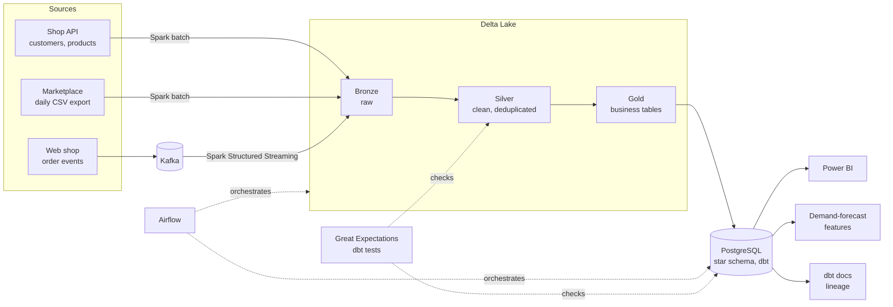
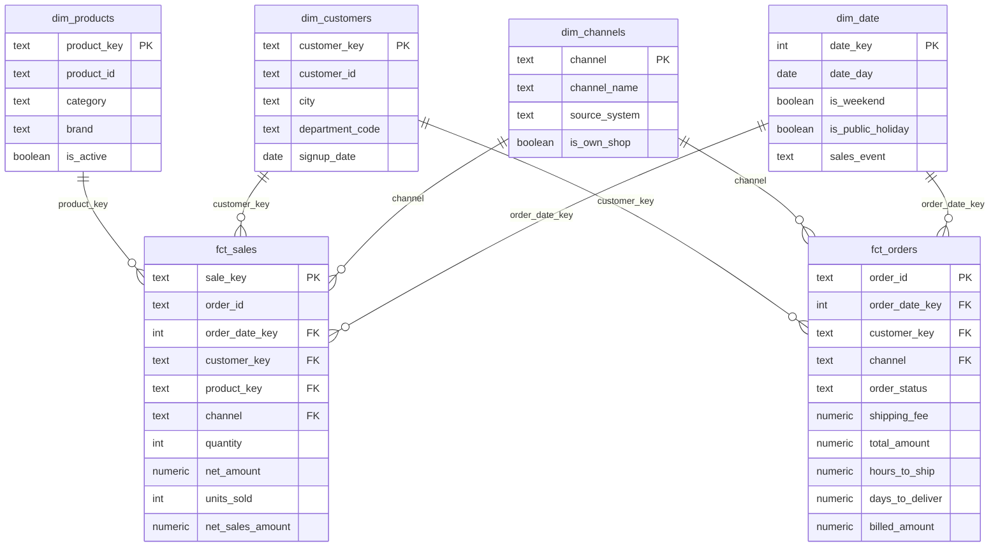
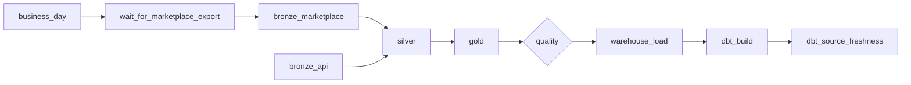
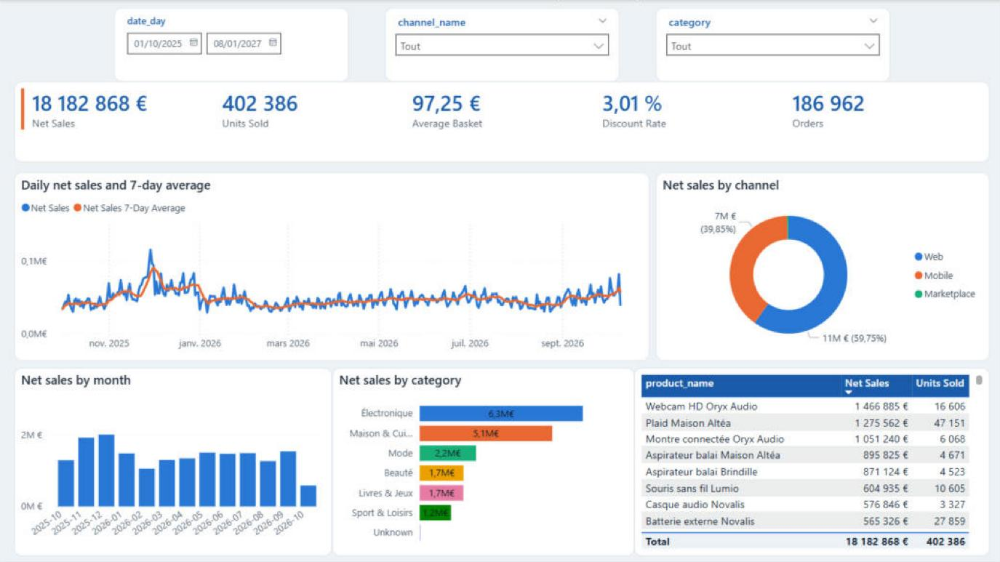
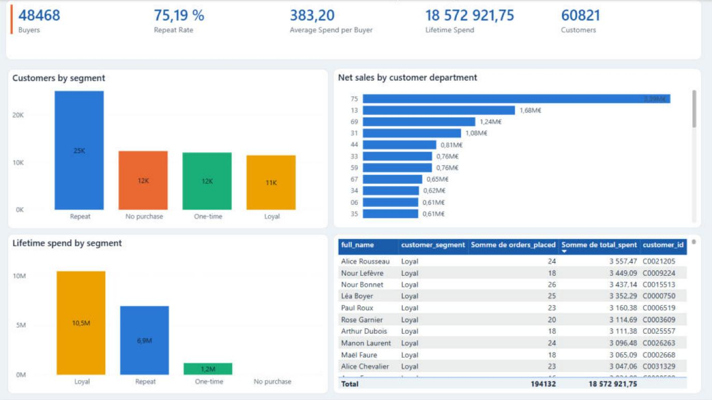
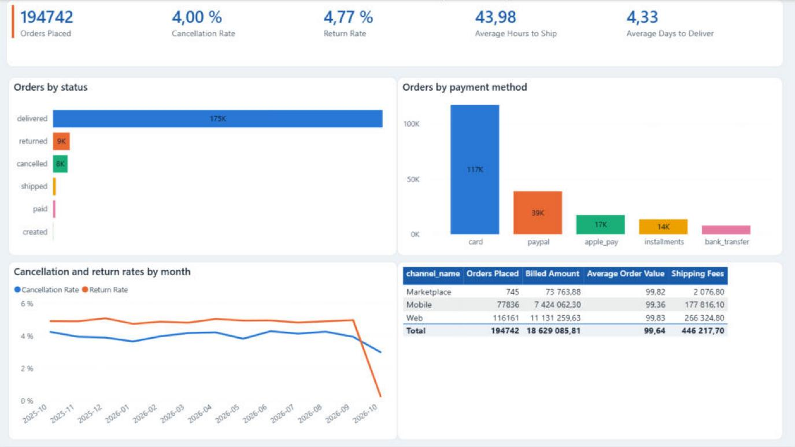
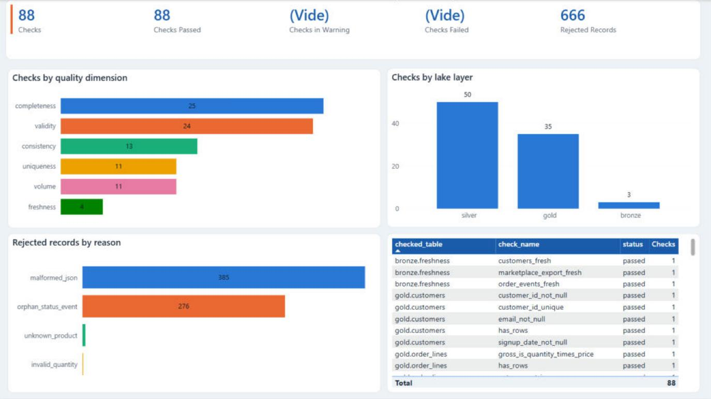
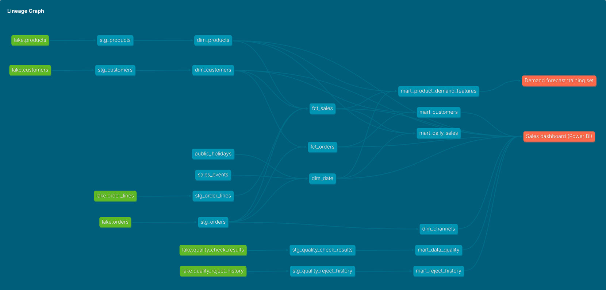

# E-commerce data platform: batch and streaming

An end-to-end data platform for a fictional French online shop. Orders arrive
from three source systems, in batch and in real time, land in a Delta Lake
organised as bronze, silver and gold layers, and end up in a star-schema
warehouse that feeds dashboards and demand-forecasting features.

**Stack:** Python · Kafka · Spark · Delta Lake · Airflow · dbt · PostgreSQL · Great Expectations · Docker

What it covers:

- **Batch and streaming ingestion** of three sources (REST API, daily CSV files, Kafka events) into Delta tables with Spark
- **A medallion lake** that types, deduplicates and reconciles the data, and sets aside what it rejects with the reason
- **A star-schema warehouse** built and tested with dbt, with data marts for reporting and for demand forecasting
- **Data quality gates**: 88 Great Expectations checks on the lake and 83 dbt tests in the warehouse, with their history
- **Daily orchestration** with Airflow: a sensor on the late source, retries, failure alerts
- **Serving**: a Power BI report with its measures and check figures, and a documentation site with the lineage from the lake to the dashboard

Everything runs on a laptop with `docker compose up`, on synthetic data that is identical on every machine.

## Architecture



## Phases

The platform was built in seven phases, each one runnable and tested before the next.

| # | Phase | What it delivers | Status |
| - | :-- | :-- | :-: |
| 1 | **Sources and streaming backbone** | Three simulated source systems (REST API, daily CSV exports, order events), Kafka, Docker Compose, tests, CI | ✅ |
| 2 | **Bronze ingestion** | Spark batch jobs for the API and the CSV files, Spark Structured Streaming for Kafka, all landing raw in Delta tables | ✅ |
| 3 | **Silver and gold** | Typing, deduplication, late and broken events, the two order sources merged into one model; business tables in gold | ✅ |
| 4 | **Warehouse** | PostgreSQL star schema with dbt: sales and orders facts, date, channel, customer and product dimensions, data marts | ✅ |
| 5 | **Data quality** | Great Expectations suites and dbt tests for completeness, uniqueness and freshness, with an anomaly log | ✅ |
| 6 | **Orchestration** | Airflow DAGs for the daily batch, with retries and failure alerts | ✅ |
| 7 | **Serving and documentation** | Power BI dashboard, demand-forecast feature table, dbt docs and lineage | ✅ |

## Quick start

You need [Docker Desktop](https://www.docker.com/products/docker-desktop/) (or Docker Engine with the Compose plugin), with about 8 GB of memory available to Docker. The first build downloads Spark and Airflow and takes around ten minutes.

```bash
# 1. Start everything: sources, Kafka, the bronze stream, the warehouse, Airflow
docker compose up -d --build

# 2. Write the marketplace CSV exports, from the start date up to yesterday
docker compose run --rm simulator export-csv

# 3. Load the API and the CSV files into the bronze tables
docker compose run --rm spark bronze-api
docker compose run --rm spark bronze-marketplace --all

# 4. Clean the data (silver), then build the business tables (gold)
docker compose run --rm spark silver
docker compose run --rm spark gold

# 5. See what each layer of the lake holds
docker compose run --rm spark status

# 6. Check the quality of the lake. Stops with an error if the data is wrong
docker compose run --rm spark quality

# 7. Load gold into the warehouse, then build and test the star schema
docker compose run --rm spark warehouse-load
docker compose run --rm dbt build

# 8. Browse the documentation of the warehouse and its lineage: http://localhost:8081
docker compose run --rm --service-ports dbt-docs
```

Order events need no command for bronze: the `bronze-events` container reads
Kafka continuously and writes to `bronze.order_events`. Silver and gold are
batch jobs; run them again whenever you want them to catch up with bronze.

Steps 2 to 7 are what Airflow runs by itself every night. Once you have seen
them work by hand, open http://localhost:8080, switch on the
`ecommerce_daily` DAG, and let it take over (see [Orchestration](#orchestration)).

Then look around:

| What | Where |
| :-- | :-- |
| Shop API, interactive docs | http://localhost:8000/docs |
| Kafka UI, topic `shop.orders.v1` | http://localhost:8085 |
| Spark UI of the streaming query | http://localhost:4040 |
| Marketplace CSV files | `data/landing/marketplace/` |
| Delta tables | `data/lake/bronze/`, `silver/`, `gold/` |
| Warehouse (PostgreSQL) | `localhost:5432`, database, user and password `warehouse` |
| Airflow | http://localhost:8080 |
| Warehouse documentation and lineage | http://localhost:8081, while the command of step 8 runs |
| Power BI report | Built from [`dashboards/`](dashboards/) |
| Data-quality report | `data/quality/gx/uncommitted/data_docs/local_site/index.html` |
| Failure alerts | `data/alerts/alerts.jsonl` |
| Producer progress | `docker compose logs -f order-producer` |

On its first start the producer replays the whole history into Kafka (a
minute or two), then keeps publishing new orders as they happen.

To stop: `docker compose down`. To start again from nothing:
`docker compose down -v`, then delete `data/landing` and `data/lake`. Delete
both together: the streaming checkpoint in the lake remembers Kafka offsets,
and they no longer exist once the Kafka volume is gone.

If you have `make`, `make help` lists shortcuts for all of the above.

## The source systems

All data is synthetic, generated by the `shop_sim` package in [`sources/`](sources/).
It is **deterministic**: the same seed gives the same customers, products,
orders and events on any machine, and any single day can be regenerated on
its own. With the default settings, one year of history is about 270,000
orders.

The shop has realistic demand: a growth trend, busier weekends, a December
peak, category seasonality, Black Friday and the French winter and summer
sales.

### 1. Shop API: customers and products

A REST API, as a back-office would expose. Paginated, and filterable with
`updated_since` for incremental loads. Records are sorted by last change, so
pages already read do not shift while a client is paginating.

```
GET /customers?page=1&page_size=500&updated_since=2026-10-01T00:00:00Z
GET /products?page=1&page_size=100
```

Customers sign up continuously and sometimes move to another city. Products
are launched, discontinued, and change price over time. The API also answers
**HTTP 503 on about 2% of calls**, on purpose, so the ingestion job has to
retry.

### 2. Marketplace: daily CSV export

Orders placed through a partner marketplace arrive as one CSV file per day,
`marketplace_orders_YYYY-MM-DD.csv`, one row per order line. Each file holds
every order **created or updated** that day, so an order appears in several
files as it goes from paid to shipped to delivered: the latest `date_maj`
wins.

The format is what a French back-office typically produces: `;` separator,
decimal comma, `dd/mm/yyyy` dates in Paris local time, French labels.

```
numero_commande;date_commande;date_maj;statut;id_client;ligne;ref_produit;quantite;prix_unitaire;remise_pct;frais_port;mode_paiement;ville_livraison;code_postal
MKP-20260919-00261;19/09/2026 23:15:12;07/10/2026 16:32:01;retournée;C0055580;1;P0042;2;49,90;0;0,00;Virement;Rouen;76000
```

### 3. Web shop: order events on Kafka

Orders from the website and the mobile app are published to the topic
`shop.orders.v1`, keyed by `order_id`. Two event types share the topic:

```json
{
  "event_id": "c2f244ca-4ac8-5280-b7e8-f50ec32a885c",
  "event_type": "order_created",
  "event_ts": "2025-09-30T22:27:43.978Z",
  "schema_version": 1,
  "order_id": "WEB-20251001-00001",
  "customer_id": "C0017747",
  "channel": "mobile",
  "payment_method": "card",
  "currency": "EUR",
  "shipping": { "city": "Tours", "postal_code": "37000", "fee": 0.0 },
  "items": [
    { "line_number": 1, "product_id": "P0036", "quantity": 2, "unit_price": 48.9, "discount_pct": 0 },
    { "line_number": 2, "product_id": "P0005", "quantity": 1, "unit_price": 81.9, "discount_pct": 0 }
  ],
  "total_amount": 179.7
}
```

```json
{
  "event_id": "6643de43-f00d-5776-b756-807ba22daba7",
  "event_type": "order_status_changed",
  "event_ts": "2025-09-30T22:31:11.684Z",
  "schema_version": 1,
  "order_id": "WEB-20251001-00001",
  "status": "paid"
}
```

Statuses are `paid`, `shipped`, `delivered`, `cancelled` and `returned`.
Delivery is at-least-once: the producer checkpoints after each batch, so a
crash can re-send one batch. Consumers deduplicate on `event_id`.

## The bronze layer

Bronze holds the sources as they arrived, in [Delta Lake](https://delta.io/)
tables under `data/lake/bronze/`. The Spark jobs live in
[`pipelines/`](pipelines/).

| Table | Source | Job | How it loads |
| :-- | :-- | :-- | :-- |
| `customers`, `products` | Shop API | `bronze-api` | Incremental batch: only records changed since the last run |
| `marketplace_orders` | CSV exports | `bronze-marketplace` | Batch per business day, replacing that day |
| `order_events` | Kafka | `bronze-events` | Spark Structured Streaming, append |

Three rules apply to every table:

- **Nothing is cleaned.** Business columns stay text, so `06000` keeps its
  leading zero and `49,90` stays a decimal comma. Duplicates, bad quantities
  and broken JSON are all kept. Typing and cleaning belong to silver, and
  keeping the raw data means any later bug can be fixed by reprocessing.
- **Every row says where it came from**: source file or Kafka partition and
  offset, load time, and the id of the run that wrote it.
- **Every load is idempotent.** Running a job twice never duplicates rows.

How each job achieves that:

- **`bronze-api`** first writes the API answers untouched to a JSON-lines
  file in `data/landing/api/` (the raw archive), then loads that file. It
  asks the API only for records changed since the newest `updated_at` in
  bronze, minus a 10-minute safety margin, and skips versions it already
  holds. The table keeps every version of a customer or product, which is
  what later allows tracking a price change or a move. HTTP 503 answers are
  retried with exponential backoff.
- **`bronze-marketplace`** loads the files of the requested days and uses
  Delta's `replaceWhere` to swap those days atomically. A rerun, a backfill
  or a corrected file from the partner all go through the same path. A
  requested day without a file fails the run, and a file whose header does
  not match the expected columns stops the load instead of shifting data.
- **`bronze-events`** stores each Kafka message as text with its
  coordinates. The streaming checkpoint and Delta's transactional commits
  give exactly-once delivery into the table, and since the payload is not
  parsed here, a malformed message cannot break ingestion.

```bash
docker compose run --rm spark bronze-marketplace                      # yesterday's file
docker compose run --rm spark bronze-marketplace --date 2026-10-07    # one day
docker compose run --rm spark bronze-marketplace --from 2026-09-01 --until 2026-09-30
docker compose run --rm spark bronze-api --entity products --full     # re-read everything
docker compose run --rm spark bronze-events                           # catch up, then stop
```

Each run prints a one-line JSON summary (rows, files, retries, duration).

The tables are not partitioned: at this volume, partitions would only
produce thousands of tiny files. On a real workload they would be
partitioned by ingestion date.

## The silver layer

Silver is each source, cleaned: typed, standardised, deduplicated and
validated. It is rebuilt entirely from bronze by one job,
`docker compose run --rm spark silver`.

| Table | Content |
| :-- | :-- |
| `customers`, `products` | Every version of each record with its validity period (`valid_from`, `valid_to`, `is_current`) |
| `order_events` | The web shop's event log: parsed, typed, one row per event |
| `web_order_lines` | Web shop orders, one row per order line, with current status |
| `marketplace_order_lines` | Marketplace orders, same columns, one row per order line |
| `rejects` | Every record silver refused, with the reason and the original content |

What cleaning means here:

- **Typing.** Text becomes dates, decimals, integers and booleans. The
  marketplace's Paris local times become UTC, decimal commas become
  decimals, French labels (`payée`, `CB`) become codes (`paid`, `card`).
- **One row per order line.** A marketplace order appears in a new export
  each day its status changes. Silver keeps one row per line with the
  latest status, and records when each status was first seen (`paid_at`,
  `shipped_at`, `delivered_at`...). For the web shop, the same result is
  obtained by folding status events into the order.
- **Nothing disappears silently.** A record that fails validation goes to
  `silver.rejects` with a reason, its original content and where it came
  from (file name, or Kafka partition and offset).

How each planted defect is handled:

| Defect | What silver does |
| :-- | :-- |
| Duplicate CSV row, event delivered twice | Removed; the run summary counts them |
| Late or out-of-order event | Nothing to fix: statuses are ordered by when they happened, not when they arrived |
| Truncated JSON payload | Rejected (`malformed_json`), never half-read |
| Status event whose order was never received | Rejected (`orphan_status_event`) |
| Status in upper case with stray spaces | Normalised, then mapped |
| Customer id missing in one export | Recovered from the other exports of the same order; left empty if none has it |
| Quantity of zero or negative, unknown product | That row is rejected. The line is repaired from another export of the same order when one is valid, and left out otherwise |
| Email in the wrong case, invalid email, missing postal code | Normalised; a value that is not valid becomes empty, the customer is kept |
| Product without category or brand, price of zero | Kept; a zero price becomes empty, and gold labels a missing category `Unknown` |

Silver is a full rebuild rather than an incremental load. At this volume it
takes a minute or two, and it means silver can never drift from bronze: when
a cleaning rule changes, the whole history gets the new rule. On a larger
dataset the same transformations would run incrementally with a Delta
`MERGE` keyed on the order.

Two limits worth knowing:

- The marketplace export gives the status at the end of each day. A status
  an order held for only part of a day (paid and shipped the same day, for
  instance) is never seen, so its timestamp stays empty.
- The export uses local time without an offset. During the hour repeated at
  the autumn clock change (02:00 to 03:00), a time is ambiguous and is read
  as the first occurrence.

## The gold layer

Gold is the business view: the two sales channels merged into one model,
rebuilt from silver with `docker compose run --rm spark gold`.

| Table | One row per | Main columns |
| :-- | :-- | :-- |
| `orders` | Order | Channel, customer, status and its dates, units, gross, discount, net, shipping and total amounts |
| `order_lines` | Product in an order | Product, quantity, unit price, discount, amounts |
| `customers` | Customer, current version | Name, email, city, sign-up date |
| `products` | Product, current version | Name, category, brand, price, active flag |

Business rules applied in gold:

- **The order date is the day in France.** An order placed at 00:30 in
  Paris belongs to that day, although it is 22:30 the day before in UTC.
- **Amounts are computed in exact decimals**: gross is quantity times unit
  price, net is gross after the line discount, total is net plus shipping.
- **The declared total is kept next to the computed one.** Web shop events
  carry the total the shop charged (`source_total_amount`). The two differ
  by a cent or two on about 8% of web orders: the shop rounds with
  floating-point arithmetic, so `49.90 x 0.85 = 42.415` becomes 42.41 there
  and 42.42 here. A gap above one cent per line would mean a line was
  rejected.

## The warehouse

The warehouse is a PostgreSQL database modelled with [dbt](https://www.getdbt.com/),
in [`warehouse/`](warehouse/). It is where analysts and dashboards connect.

```bash
docker compose run --rm spark warehouse-load   # copy gold into PostgreSQL
docker compose run --rm dbt build              # build and test every model
docker compose exec warehouse psql -U warehouse -d warehouse   # SQL prompt
```

### Layers

Each layer is a PostgreSQL schema:

| Schema | Built by | Content |
| :-- | :-- | :-- |
| `lake` | Spark job | The four gold tables and the quality history, copied as they are |
| `reference` | dbt seeds | Hand-maintained tables: French public holidays, sales events |
| `staging` | dbt, views | One view per source table, with settled column names |
| `core` | dbt, tables | The star schema |
| `marts` | dbt, tables | Tables shaped for one use each |

### Star schema



Two fact tables share the dimensions. `fct_sales` has one row per product
sold in an order and answers what sold, to whom and when. `fct_orders` has
one row per order and holds what only exists at that level: shipping, totals
and the time from order to shipment and delivery.

Modelling choices:

- **Surrogate keys are hashes of the business key.** A given customer always
  gets the same key, so a dimension can be rebuilt without rebuilding the
  facts that point to it.
- **Each dimension has an "Unknown" member.** A sale whose customer is
  missing points to it instead of holding an empty key, so joining a fact to
  a dimension never drops rows.
- **Cancelled orders stay in the facts** with zero in `units_sold`,
  `net_sales_amount` and `billed_amount`. Sales measures add up correctly
  without a filter, and cancellations remain available for analysis.
- **The channel is a dimension of its own**, small as it is. Both facts
  carry it, and a report needs one place to filter it from: a slicer on
  `dim_channels` filters sales and orders together. Its three codes are
  short and stable, so they serve as the key without a hash.
- **The date dimension knows the French calendar**: public holidays, Black
  Friday week, winter and summer sales. It extends 90 days past the last
  order so forecasts can be joined to it.

### Marts

| Mart | One row per | For |
| :-- | :-- | :-- |
| `mart_daily_sales` | Day, channel and category | Quick SQL questions and light reports, already aggregated |
| `mart_customers` | Customer | Purchase history, recency, segment (No purchase, One-time, Repeat, Loyal) |
| `mart_product_demand_features` | Product and day | Training a demand-forecasting model |
| `mart_data_quality` | Quality check and run | Following the quality checks over time |
| `mart_reject_history` | Rejection reason and run | Following rejected records over time |

The demand table is built to be safe to train on: days without sales are
present with zero units, every past-demand feature (lags, 7 and 28-day
averages) stops at the day before, and the current, incomplete day is left
out.

### Loading

`warehouse-load` streams each gold table into PostgreSQL through `COPY`, its
bulk-loading path, along with the history of quality results. All tables
are replaced in a single transaction, so a query never sees orders without
their lines, and a load that fails leaves the previous one in place. Each
row carries a `_loaded_at` timestamp.

## Data quality

Quality is checked in two places, with the tool that fits each: Great
Expectations on the lake, before anything reaches the warehouse, and dbt
tests inside the warehouse.

```bash
docker compose run --rm spark quality          # 88 checks on the lake
docker compose run --rm dbt build              # models and 83 tests in the warehouse
docker compose run --rm dbt source freshness   # is the warehouse load recent?
```

### What is checked

| Dimension | Question | On the lake (Great Expectations) | In the warehouse (dbt) |
| :-- | :-- | :-- | :-- |
| Completeness | Are required values there? | Keys never empty; at least 99% of orders have a customer | Keys never empty; at least 99% of customers have an email |
| Uniqueness | Any duplicates? | One row per order, per order line, per event; one current version per customer | Unique keys in every dimension and fact; one row per day, channel and category in the sales mart |
| Validity | Are values plausible? | Known statuses and channels, positive quantities, discounts between 0 and 100, well-formed emails and postal codes | Same ranges on the facts; no order dated in the future |
| Consistency | Do values agree with each other? | Total equals net plus shipping; computed total matches the shop's declared total; every line has its order and its product; shipped after ordered | Every fact row finds its dimensions; facts and marts sum to the same amounts as the lake |
| Freshness | Is the data recent? | An event ingested in the last hour, yesterday's export loaded, orders from today or yesterday | Warehouse loaded in the last 26 hours; a recent order in the facts |
| Volume | Is the amount of data normal? | Tables are not empty; no source has more than 1% of its rows rejected | Share of orders without a known customer under 1% |

### Errors and warnings

Every check has a severity, and the two behave differently:

- **Error**: the data is wrong (a duplicated order, a total that does not
  add up). `spark quality` exits with a failure, which stops the pipeline
  before the warehouse is loaded: bad data stays in the lake.
- **Warning**: something to look at, but the data is usable (a few more
  missing emails than usual, a source that is late). The run continues.

Freshness checks are warnings on purpose. Refusing to publish data because
it is stale would only make it staler.

### Following anomalies over time

A check that passes today tells little; a check that starts drifting tells a
lot. So every result is kept, not just the failures:

- `quality.check_results` in the lake receives one row per check at each
  run, with what was observed (the number of offending rows, their share,
  a few examples).
- `quality.reject_history` receives the number of records silver rejected,
  per source and reason. `silver.rejects` only shows the current state;
  this is its history.
- Both are loaded into the warehouse and exposed as `mart_data_quality` and
  `mart_reject_history`, ready for a dashboard.
- Great Expectations also writes an HTML report of each run, to open in a
  browser: `data/quality/gx/uncommitted/data_docs/local_site/index.html`.
- In the warehouse, the reconciliation tests keep the rows that fail them in
  the `test_failures` schema: when a total stops matching, the orders at
  fault are in a table, not just counted in a log.

## Orchestration

Airflow runs the batch side of the platform every night. The DAG is in
[`orchestration/dags/ecommerce_daily.py`](orchestration/dags/ecommerce_daily.py),
and the Airflow interface at http://localhost:8080.



| Task | What it does |
| :-- | :-- |
| `business_day` | Works out the day to load: the day before the run, in French time |
| `wait_for_marketplace_export` | Waits for the partner's CSV file of that day |
| `bronze_marketplace`, `bronze_api` | Load the file and the API changes into bronze, side by side |
| `silver`, `gold` | Rebuild the cleaned and the business tables |
| `quality` | Runs the Great Expectations checks. An error stops the run here |
| `warehouse_load`, `dbt_build` | Load PostgreSQL, build and test the star schema |
| `dbt_source_freshness` | Confirms the warehouse was just fed |

The run starts at 03:00 Paris time. To start one right away:

```bash
docker compose exec airflow airflow dags unpause ecommerce_daily
docker compose exec airflow airflow dags trigger ecommerce_daily
```

How the DAG deals with what goes wrong:

- **A source is late.** The sensor checks for the marketplace file every
  minute for two hours, without holding a worker in between. If the file
  never comes, the run fails rather than publish a day without marketplace
  sales.
- **A step fails for a passing reason** (the API is down, a container
  restarts). Loading steps are retried twice, with a pause that grows each
  time. They
  are idempotent, so a retry can never load the same data twice.
- **The data is wrong.** The quality gate and the dbt tests are not retried:
  the same data would fail the same way. The run stops, and the warehouse
  keeps yesterday's data instead of receiving bad data.
- **Someone has to know.** When a task has used up its retries, an alert
  goes out with the task, the number of attempts, the error and a link to
  the log. It is always written to `data/alerts/alerts.jsonl`, and posted to
  a chat webhook (Slack, Teams, Mattermost) if `ALERT_WEBHOOK_URL` is set
  in `.env`.
- **A day has to be redone.** Trigger the DAG with a `business_day`
  parameter to reprocess that day.

What is not in the DAG, and why:

- **Order events.** They are ingested continuously by the `bronze-events`
  streaming service. Airflow orchestrates batch work; a stream that never
  ends is a service, not a task.
- **The partner's export.** The `marketplace-exporter` container plays the
  partner and drops each day's file after midnight. The pipeline only waits
  for it, as it would for a real partner.

Airflow launches the same commands as the ones typed by hand. The Spark jobs
and dbt each run in a virtual environment of their own inside the Airflow
image, so their dependencies never have to agree with Airflow's.

The setup is sized for a laptop: one container runs the scheduler, the DAG
processor and the web interface, and no login is asked. A production
deployment would run these components separately, with authentication.

## Serving

What the warehouse is for: a report, a training table, and a documentation
site that tells a newcomer what each table means and where it comes from.

### Dashboard

A four-page Power BI report reads the star schema: sales overview,
customers, order operations and data quality. Power BI files cannot be
generated from code, so [`dashboards/`](dashboards/) holds what makes the
report reproducible and verifiable:

| File | Content |
| :-- | :-- |
| [`README.md`](dashboards/README.md) | The build guide: connection, model and relationships, the four pages visual by visual |
| [`measures.dax`](dashboards/measures.dax) | The 34 measures, as one DAX query that also returns their values |
| [`check_figures.sql`](dashboards/check_figures.sql) | The same figures computed in SQL on the warehouse |
| [`theme.json`](dashboards/theme.json) | Colours and fonts |

The check figures are the point. A dashboard is trusted when its numbers
can be traced: every card and chart of the report has a query of the same
name in `check_figures.sql`, and the two must agree.

```bash
docker compose cp dashboards/check_figures.sql warehouse:/tmp/check_figures.sql
docker compose exec warehouse psql -U warehouse -d warehouse -f /tmp/check_figures.sql
```

<!--
Uncomment once the four page images are in docs/images/ (see step 8 of dashboards/README.md).

| Sales overview | Customers |
| :-: | :-: |
|  |  |
| **Operations** | **Data quality** |
|  |  |
-->

### Demand-forecast features

`marts.mart_product_demand_features` is a training table: one row per
product and per day, `units_sold` as the target, and features that are all
known before the day starts (lags, rolling averages, calendar). No model is
trained in this repository; the table is where one would start.

Any model has to beat the obvious guesses first. This query scores three of
them on the last 28 days, as a mean absolute error in units per product and
day:

```sql
with recent as (
    select *
    from marts.mart_product_demand_features
    where days_on_sale >= 28
      and date_day > (select max(date_day) from marts.mart_product_demand_features) - 28
)
select
    round(avg(abs(units_sold - units_sold_lag_7)), 3)   as same_weekday_last_week,
    round(avg(abs(units_sold - units_sold_avg_7d)), 3)  as average_of_last_7_days,
    round(avg(abs(units_sold - units_sold_avg_28d)), 3) as average_of_last_28_days
from recent;
```

### Documentation and lineage

dbt generates a documentation site from the project: every table and column
with its description, the tests that guard it, the SQL behind it, and the
graph of what depends on what.

```bash
docker compose run --rm --service-ports dbt-docs    # then http://localhost:8081, Ctrl+C to stop
```



Sources are in green, models in blue, and the consumers of the warehouse in
orange. The Power BI report and the forecast training set are declared as
dbt [exposures](warehouse/models/exposures.yml), which puts them on the
graph: before changing a model, the lineage shows which report it feeds.

```bash
# Everything the dashboard depends on, back to the lake
docker compose run --rm dbt ls --select +exposure:sales_dashboard
```

Documentation drifts unless something checks it. CI runs
[`ci/check_docs.py`](warehouse/ci/check_docs.py) after building the
warehouse: the build fails if a column of the `core` or `marts` schemas has
no description, or if a described column no longer exists.

The site can also be published to GitHub Pages: enable Pages once in the
repository settings (Settings > Pages > Source: GitHub Actions), then start
the CI workflow by hand from the Actions tab. Its `publish-docs` job only
runs then.

## Data defects, injected on purpose

Clean sources would leave nothing for the quality checks to do. The simulator
plants a small, known share of defects, which the later phases must detect
and handle.

| Source | Defect | Share |
| :-- | :-- | --: |
| API, customers | Email in upper case with stray spaces | 1% |
| API, customers | Missing postal code | 0.5% |
| API, customers | Invalid email (no `@`) | 0.2% |
| API, products | Missing category | 1.5% |
| API, products | Missing brand | 1.5% |
| API, products | Price of zero | 1% |
| CSV | Exact duplicate row | 0.5% |
| CSV | Status in upper case with a trailing space | 0.5% |
| CSV | Missing customer id | 0.3% |
| CSV | Quantity of zero or negative | 0.2% |
| CSV | Unknown product reference | 0.2% |
| Kafka | Late event, delivered 1 to 30 minutes after it happened | 2% |
| Kafka | Duplicate delivery of the same event | 1% |
| Kafka | `order_created` without a customer id | 0.3% |
| Kafka | Truncated payload, not valid JSON | 0.05% |

Format traps that are not defects, but that ingestion has to get right:
postal codes with a leading zero (`06000`), Paris local time in the CSV
against UTC in the events, and decimal commas.

Set `SIM_DEFECT_RATE=0` to get perfectly clean sources.

## Configuration

Copy `.env.example` to `.env` to change the defaults.

| Variable | Default | Meaning |
| :-- | :-- | :-- |
| `SIM_SEED` | `42` | Same seed, same data |
| `SIM_START_DATE` | `2025-10-01` | First day of history |
| `SIM_ORDERS_PER_DAY` | `600` | Average orders per day at the start date |
| `SIM_DEFECT_RATE` | `1.0` | Multiplier on every injected defect |
| `SIM_API_ERROR_RATE` | `0.02` | Share of API calls answered with 503 |
| `SPARK_DRIVER_MEMORY` | `2g` | Memory given to each Spark job |
| `WAREHOUSE_PASSWORD` | `warehouse` | Password of the warehouse database |
| `WAREHOUSE_HOST_PORT` | `5432` | Port of the warehouse on your machine; change it if another PostgreSQL already uses 5432 |
| `AIRFLOW_HOST_PORT` | `8080` | Port of the Airflow interface on your machine |
| `DBT_DOCS_HOST_PORT` | `8081` | Port of the dbt documentation site on your machine |
| `ALERT_WEBHOOK_URL` | empty | Chat webhook that receives failure alerts |

## Tests

Each part has its own tests, all run on every push with GitHub Actions.

```bash
# Spark jobs: parsing, API retries, idempotent loads, cleaning rules, amounts, warehouse load
docker compose run --rm --no-deps --entrypoint python spark -m pytest

# Warehouse: dbt builds every model and runs its tests
docker compose run --rm dbt build

# Documentation: every column of the star schema and the marts is described
docker compose run --rm dbt docs generate
docker compose run --rm --entrypoint python dbt ci/check_docs.py

# Orchestration: the DAG loads, runs in the right order, retries and alerts as intended
cd orchestration
pip install -r requirements-dev.txt \
  --constraint https://raw.githubusercontent.com/apache/airflow/constraints-3.3.2/constraints-3.12.txt
python -m pytest
cd ..

# Simulator: determinism, referential integrity, amounts, pagination, checkpointing
cd sources
pip install -r requirements-dev.txt
python -m pytest
```

The tests of the warehouse load need a PostgreSQL and are skipped when none
is reachable. They write to a schema of their own, so they can run against
the project's warehouse without touching its data.

## Repository layout

```
.
├── docker-compose.yml        Every service: sources, Kafka, bronze stream, warehouse, Airflow, dbt docs
├── sources/
│   ├── shop_sim/             The simulated source systems
│   │   ├── world.py          Customers and products, with their history
│   │   ├── orders.py         Demand model, baskets, order lifecycle
│   │   ├── api.py            Source 1: REST API
│   │   ├── csv_export.py     Source 2: marketplace CSV files
│   │   ├── events.py         Source 3: order events
│   │   ├── producer.py       Replay and live publishing, with checkpoint
│   │   └── sinks.py          Kafka, file and stdout outputs
│   └── tests/
├── pipelines/
│   ├── lakehouse/            The Spark jobs
│   │   ├── session.py        Spark session with Delta Lake and the Kafka connector
│   │   ├── lake.py           Delta reads and writes
│   │   ├── api_client.py     Pagination and retries for the Shop API
│   │   ├── bronze/
│   │   │   ├── api.py            Shop API -> customers, products
│   │   │   ├── marketplace.py    CSV exports -> marketplace_orders
│   │   │   └── order_events.py   Kafka -> order_events
│   │   ├── silver/
│   │   │   ├── reference.py      Customers and products, with history
│   │   │   ├── marketplace.py    Marketplace exports -> order lines
│   │   │   ├── order_events.py   Event log -> web shop order lines
│   │   │   └── job.py            Rebuilds silver and the rejects table
│   │   ├── gold/
│   │   │   ├── build.py          Orders, order lines, customers, products
│   │   │   └── job.py            Rebuilds gold
│   │   ├── warehouse.py      Gold -> PostgreSQL, with COPY
│   │   ├── quality/
│   │   │   ├── suites.py         The checks, table by table
│   │   │   └── runner.py         Runs them, stores the results, builds the report
│   │   └── status.py         Row counts and key figures of every layer
│   └── tests/
├── warehouse/                The dbt project
│   ├── models/
│   │   ├── staging/          One view per table loaded from the lake
│   │   ├── core/             Star schema: dim_date, dim_channels, dim_customers, dim_products, fct_sales, fct_orders
│   │   ├── marts/            Daily sales, customers, demand features, quality history
│   │   ├── exposures.yml     What reads the warehouse: the dashboard, the forecast training set
│   │   └── overview.md       Home page of the documentation site
│   ├── seeds/                Public holidays and sales events
│   ├── tests/                Reconciliation and monitoring tests, generic tests
│   ├── macros/               Surrogate keys, schema naming
│   └── ci/                   Sample data used by CI, documentation coverage check
├── orchestration/
│   ├── dags/
│   │   ├── ecommerce_daily.py    The daily batch
│   │   └── common/alerting.py    Failure alerts
│   ├── tests/
│   └── Dockerfile            Airflow, with the Spark jobs and dbt in their own environments
├── dashboards/               Power BI report: build guide, DAX measures, check figures, theme
├── docs/images/              Images used by this README
└── data/                     Generated files and the lake, not versioned
```

## Limits, and what production would change

The platform is complete, but sized and simplified for one machine. What
that means, stated plainly:

- **The data is synthetic.** The simulator has a demand model and planted
  defects, but real sources misbehave in ways no one thought to simulate.
  Some regularities show in the report, such as delivery times that are the
  same on every channel.
- **Everything is single-node.** Spark runs in local mode, Kafka has one
  broker and no replication, the lake is a folder on disk. Production would
  use object storage, a Spark cluster and a replicated Kafka. The jobs
  would keep their logic: paths and Spark settings already come from
  configuration.
- **Silver and gold are rebuilt in full** at each run, and the warehouse is
  reloaded in full. That is the simplest thing that is always correct, and
  it is fast at this volume. With years of history it would become
  incremental: `MERGE` into silver and gold, incremental dbt models.
- **Only bronze is real time.** Events reach the lake within seconds, but
  the warehouse is refreshed by the nightly batch. Fresher reporting would
  mean a streaming silver layer, not a faster Airflow schedule.
- **Airflow runs as one container without login**, and passwords have
  defaults in the Compose file. Production would run the scheduler and the
  web server apart, behind authentication, with secrets in a vault.
- **No forecasting model.** The platform stops at the feature table.
- **The Power BI report is built by hand** from the guide. Its measures and
  check figures are versioned; the `.pbix` itself is a binary file that
  cannot be reviewed or tested in CI.
- **Customer data is not protected.** Names and emails are fake here. Real
  ones would need masking in the lake and restricted access in the
  warehouse.
