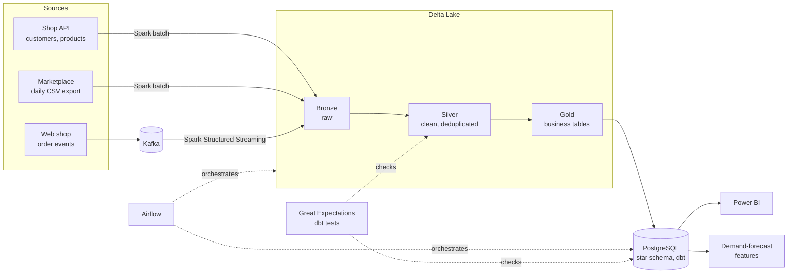

# E-commerce data platform: batch and streaming

An end-to-end data platform for a fictional French online shop. Orders arrive
from three source systems, in batch and in real time, land in a Delta Lake
(bronze, silver, gold), and end up in a star-schema warehouse that feeds a
Power BI report and a demand-forecast feature table.

**Stack:** Python · Kafka · Spark · Delta Lake · Airflow · dbt · PostgreSQL · Great Expectations · Docker · Power BI

## What it does

- **Ingests three sources** into Delta tables with Spark: a REST API and daily CSV files in batch, Kafka order events in streaming
- **Cleans and reconciles** the data in a medallion lake, and sets aside every rejected record with the reason
- **Models a star schema** in PostgreSQL with dbt: two facts, four dimensions, data marts for reporting and forecasting
- **Gates on data quality**: 88 Great Expectations checks on the lake and 83 dbt tests in the warehouse, with their history kept
- **Runs every night** under Airflow, with a sensor on the late source, retries and failure alerts
- **Serves** a four-page Power BI report and a documentation site with the lineage from the lake to the dashboard

Everything runs on a laptop with Docker Compose, on synthetic data that is identical on every machine.

## Architecture



## Dashboard

A Power BI report ([`rapport.pbix`](rapport.pbix)) reads the star schema.

| Sales overview | Customers |
| :-: | :-: |
|  |  |
| **Operations** | **Data quality** |
|  |  |

Its numbers can be traced: [`dashboards/check_figures.sql`](dashboards/check_figures.sql)
computes the same figures in SQL on the warehouse, and
[`dashboards/measures.dax`](dashboards/measures.dax) holds the 34 measures.

## Data model and lineage

The warehouse is a star schema built by dbt: `fct_sales` (one row per product
sold) and `fct_orders` (one row per order), sharing the date, channel,
customer and product dimensions. dbt also generates the documentation site
and this lineage graph, from the lake tables to the report:


## Run it

You need Docker Desktop with about 8 GB of memory. The first build takes around ten minutes.

```bash
docker compose up -d --build                           # sources, Kafka, bronze stream, warehouse, Airflow
docker compose run --rm simulator export-csv           # write the marketplace CSV exports
docker compose run --rm spark bronze-api               # load the API
docker compose run --rm spark bronze-marketplace --all # load the CSV files
docker compose run --rm spark silver                   # clean
docker compose run --rm spark gold                     # business tables
docker compose run --rm spark quality                  # stops here if the data is wrong
docker compose run --rm spark warehouse-load           # copy gold into PostgreSQL
docker compose run --rm dbt build                      # build and test the star schema
```

After this first load, Airflow runs the same steps every night: open
http://localhost:8080 and switch on the `ecommerce_daily` DAG.

| What | Where |
| :-- | :-- |
| Airflow | http://localhost:8080 |
| Kafka UI | http://localhost:8085 |
| Shop API | http://localhost:8000/docs |
| Warehouse | `localhost:5432`, database, user and password `warehouse` |
| dbt docs and lineage | `docker compose run --rm --service-ports dbt-docs`, then http://localhost:8081 |

## Design choices

- **Loads are idempotent.** A day can be reloaded, or a task retried, without duplicating data.
- **Nothing is dropped silently.** Records that fail a rule go to a rejects table with the reason, and the counts are followed run after run.
- **Bad data stops before the warehouse.** A failed quality check ends the run, and the warehouse keeps the previous day's data.
- **The sources misbehave on purpose.** The simulator plants duplicates, late events, broken JSON and missing keys at known rates, so the cleaning rules and checks have something real to catch.
- **Surrogate keys are hashes** and every dimension has an "Unknown" member, so facts and dimensions can be rebuilt independently and no sale is lost in a join.

## Tests

Each part has its own tests, run on every push by GitHub Actions: 49 for the
source simulator, 93 for the Spark jobs, 83 dbt tests on the warehouse and 12
for the Airflow DAG. CI also fails if a warehouse column is left undocumented.

## Repository layout

```
sources/         Simulated source systems: API, CSV exports, Kafka producer
pipelines/       Spark jobs: bronze, silver, gold, quality checks, warehouse load
warehouse/       dbt project: staging, star schema, marts, tests
orchestration/   Airflow DAG and alerting
dashboards/      Power BI measures, check figures, theme, build guide
docs/images/     Images used in this README
```

## Limits

- The data is synthetic, and everything runs on one machine: Spark in local mode, a single Kafka broker, the lake on local disk.
- Silver, gold and the warehouse are rebuilt in full at each run. With more volume they would become incremental.
- Only bronze is real time; the warehouse is refreshed by the nightly batch.
- The platform stops at the forecast feature table: no model is trained.
